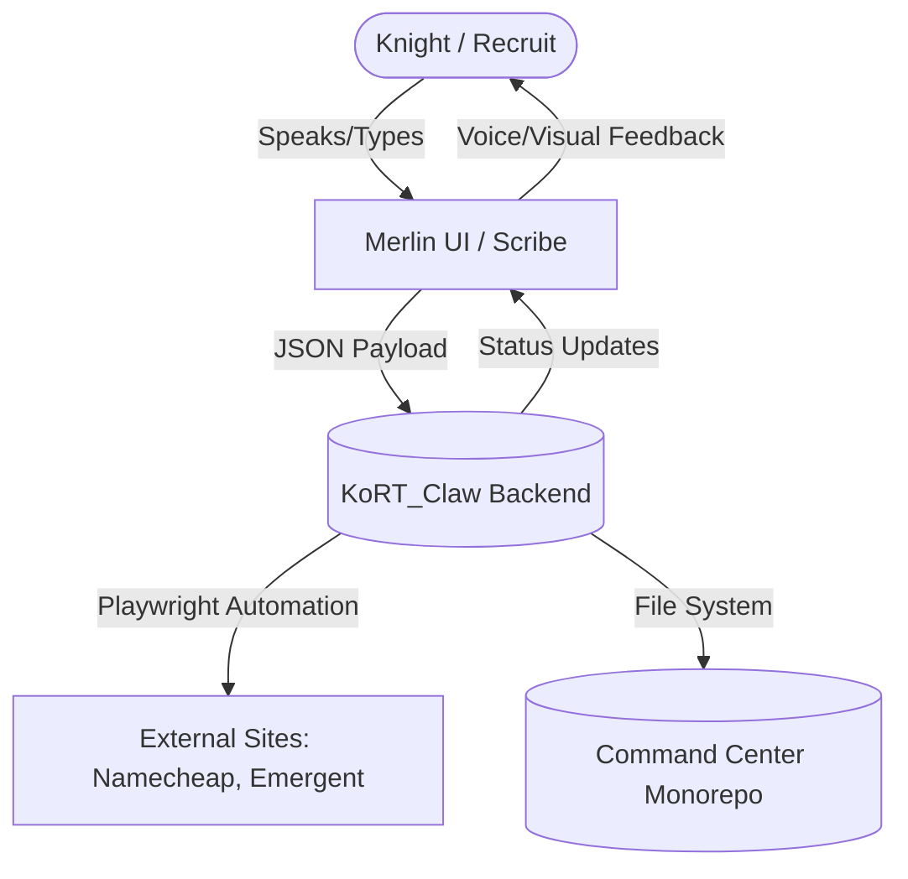
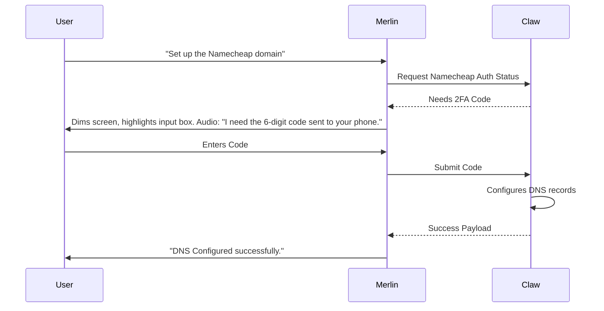

# 🗺️ KORT SOVEREIGN ECOSYSTEM: MASTER MANUAL & SCHEMATICS

**Status:** ACTIVE
**Version:** 1.0 (Authorized by Knight Mike)
**Date:** 2026-05-11

---

## 1. THE SOVEREIGN ARCHITECTURE OVERVIEW

The KoRT Ecosystem is a decentralized, self-hosted (local-first) mesh of micro-apps, AI agents, and ledgers. It is designed to be completely independent of closed 3rd-party cloud environments. 

### The Core Paradigm: Merlin & KoRT_Claw
The entire system operates on a dual-layer AI paradigm:
1. **Merlin (The Voice/Face):** The conversational UI powered by Gemini API credits (via Emergent/Workshop). Merlin interacts with the user, provides tooltips, dims the screen, and translates human intent into machine instructions.
2. **KoRT_Claw (The Hands):** A specialized fork of `open_claw` operating as a headless backend executor. While the user speaks to Merlin, KoRT_Claw physically manipulates the browser, accesses GitHub, moves files, configures nameservers, and manages the local file system.

---

## 2. THE QUANTUM QUORUM (133 AGENTS)

The ecosystem integrates 133 specialized AI agents built on external platforms (Emergent, Base44, Primio, etc.). 

**The Golden Rule:** We NEVER link directly to closed 3rd-party dev environments. All agents are ingested into the Sovereign Monorepo.

### The Ingestion Pipeline (KoRT_Claw Automated)
To bypass the complexity of 133 separate GitHub repositories, KoRT_Claw automates the extraction and ingestion process:
1. **Extract:** KoRT_Claw logs into the 3rd-party builder.
2. **Download:** It downloads the agent's code as a ZIP file.
3. **Ingest:** It runs the `Ingest_Quantum_Agent.ps1` script to unpack the code directly into `D:\KoRT_Command_Center\Apps\Quantum_Quorum\[AgentName]`.
4. **Track:** The code is committed to the local Git tracking safely without overwriting the monorepo root.

---

## 3. KEY SOVEREIGN MODULES

### A. Knights Dispatch (The Triage Engine)
*   **Role:** The front-line routing system.
*   **Engine:** Uses Gemini API credits to talk to the user.
*   **Flow:** Evaluates the user's need. If legal/ICBC, routes to the **Digital Advocate**. If recovery/detox, routes to the **Digital Sponsor**.

### B. The Digital Scribe (The Documentarian)
*   **Role:** The sole entity permitted to write and edit documentation.
*   **Protocol:** Operates strictly on ADD and MERGE rules (Rule #6). Generates meeting notes, updates the Wiki, and logs actions.

### C. Digital Dollars (The Ledger)
*   **Role:** The internal economy tracking system.
*   **Engine:** Uses local SQLite/Postgres (migrating away from Supabase cloud dependence) to track affiliate links and mission rewards.

---

## 4. "MONKEY-PROOF" UI/UX SPECIFICATION

To ensure offline recruits can operate the system, the Merlin/Claw interface must adhere to strict UX guidelines:

1. **Screen Dimming:** When an action requires user input (e.g., entering an API key), the background UI dims (opacity 0.5) to lock focus.
2. **Highlighting:** A brightly colored (Gold/Cyan) bounding box highlights the exact input field.
3. **Merlin Voice:** Merlin provides audio instructions explaining *what* is happening and *why*.
4. **Tooltips:** Hovering over any element must display a plain-English explanation derived from the Sovereign Directives.

---
*Documented by Antigravity under Direct Order of Knight Mike*
